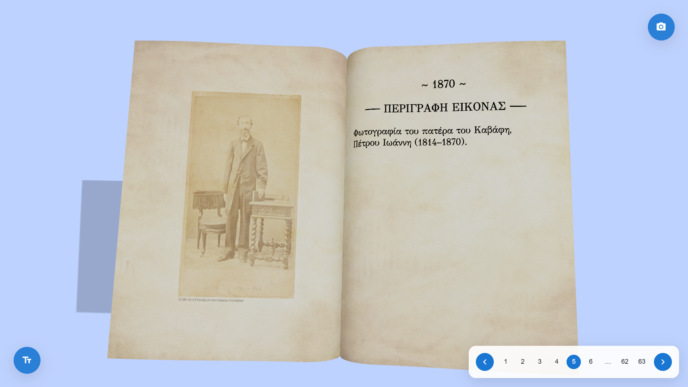
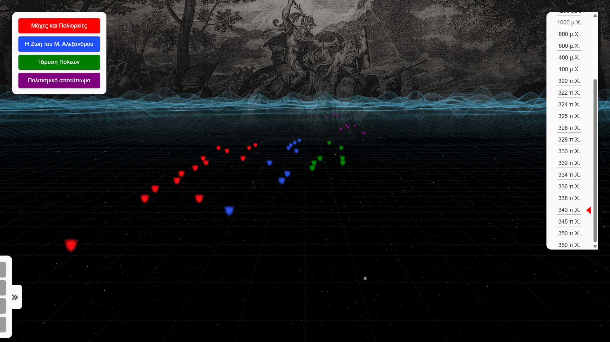

# Internship Projects

During my internship, I developed 2 major projects that I’m particularly proud of.  
Both projects focus on interactive 3D experiences for cultural and historical content.

---

## 3D Book
**Live Demo:** [ebook.ontovisual.dev](https://ebook.ontovisual.dev/)  
**Source Code:** [`PROTOTYPES/my-book`](./PROTOTYPES/my-book)

A 3D digital book that allows users to flip through pages in an immersive environment.  
It showcases historical photographs and descriptions in a realistic virtual format.

---

## Alexander the Great - Interactive Timeline
**Live Demo:** [alexander-timeline.ontovisual.dev](https://alexander-timeline.ontovisual.dev/)  
**Source Code:** [`PROTOTYPES/alex-remake`](./PROTOTYPES/alex-remake)

A 3D interactive timeline that visualizes the life and campaigns of Alexander the Great.  
Users can explore battles, city foundations, and cultural landmarks across time.

